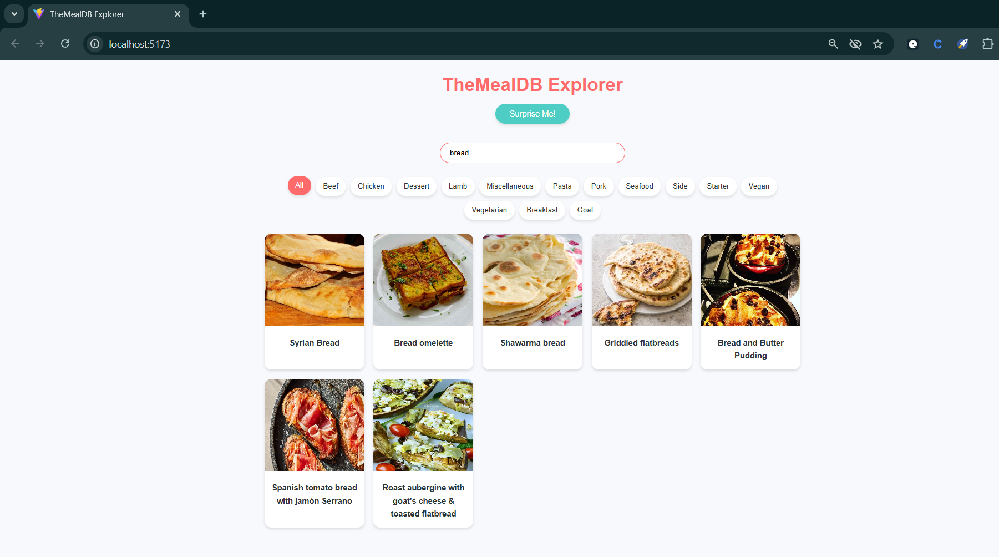
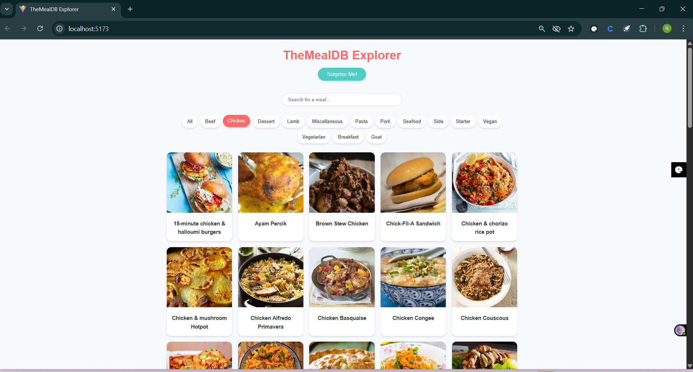
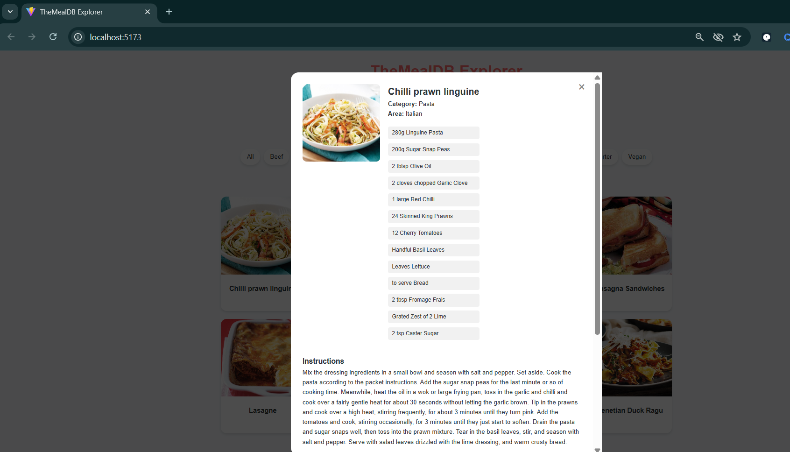

# TheMealDB Explorer

TheMealDB Explorer is a full-stack web application for browsing meals, exploring categories, and viewing detailed recipes via TheMealDB public API. It consists of a Spring Boot backend (REST + caching) and a React frontend (responsive UI).

---

## 1. Project Overview

- Simplifies TheMealDB API with clean REST endpoints.  
- Backend caches responses to prevent redundant upstream calls and returns consistent JSON envelopes.  
- Frontend focuses on clarity, responsiveness, and low overhead.  
- Entire project runs locally; no external databases or services are required.

---

## 2. Architecture

### Backend (Spring Boot)
- Proxies TheMealDB API using Spring’s RestClient.  
- Implements in-memory caching using Caffeine (TTL + max size).  
- Normalizes cache keys for reliable cache hit detection.  
- Returns unified API response format:

### Frontend (React + Vite)
- Communicates exclusively with the backend using Fetch API.  
- Features include search, category browsing, filtering, random meal loading, and detailed recipe display.  
- Dynamically extracts up to 20 ingredients per recipe.  
- Embeds YouTube videos when available.  
- Uses CSS Grid and Flexbox for a responsive layout.

---

## 3. Backend Endpoints

| Endpoint                | Description                   |
|-------------------------|-------------------------------|
| GET /api/search?q={x}   | Search meals by name          |
| GET /api/categories     | List all categories           |
| GET /api/category/{x}   | List meals in a category      |
| GET /api/random         | Retrieve a random meal        |
| GET /api/meal/{id}      | Retrieve meal details         |

Upstream source:  
https://www.themealdb.com/api/json/v1/1/

### Caching Configuration
- Cache provider: Caffeine  
- Max size: 500 entries  
- Expiry: 1 hour  
- Cached: search results, categories, category meals, meal details  
- Not cached: random meal (to preserve randomness)

---

## 4. Frontend Features

- Search meals by name  
- Browse all available categories  
- View meals within a category  
- Detailed recipe view: ingredients, instructions, and embedded YouTube video  
- Random meal generation  
- Responsive design for mobile and desktop screens  
- Environment configuration:

---

## 5. Running the Application

### Backend
cd backend
mvn spring-boot:run

### Frontend
cd frontend
npm install
npm run dev

---

## 6. Project Structure

TheMealDB-Explorer/
├── backend/
│ ├── src/main/java/com/example/mealapi/
│ ├── src/main/resources/
│ └── pom.xml
├── frontend/
│ ├── src/
│ ├── public/
│ └── package.json
├── assets/ # Screenshots
└── README.md

---

## 7. Screenshots

output screenshots are in the `assets/` directory:
- 
- 
- 

---

## 8. Notes

- Caffeine was selected for its simplicity and high performance in local development.  
- Cache keys are normalized to avoid misses due to case or whitespace differences.  
- Unified response envelopes simplify frontend integration and improve consistency.  
- The frontend intentionally avoids unnecessary libraries or complexity.

---

## 9. Conclusion

TheMealDB Explorer fulfills all assignment requirements: local execution, RESTful design, effective caching, responsive UI, and clear architectural separation.  
It demonstrates practical full-stack development skills using Spring Boot and React.

